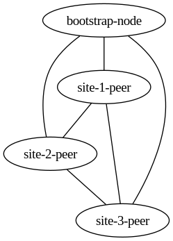

# Campfire Network

This example shows a fully peer-to-peer network negotiated over the Campfire protocol.
The Campfire protocol was originally conceived by [TheRook](https://github.com/therook) as a way to allow peers to discover each other without the need for a central server.

The protocol is still in its infancy, but a rought draft implementation is included in Webmesh as a proof of concept.
The idea is that peers using a pre-shared key and shared list of TURN servers can discover each other and establish a peer-to-peer connection.
Hashes of the pre-shared key are used to generate unique identifiers for each peer and to pick a constant TURN server to "camp" on.

The current implementation requires a TURN server capable of handling the campfire protocol extensions.
One is included with the Webmesh project.
It is installed with the `webmesh` package as `webmesh-turn`, but can also be run as a container with:

```bash
docker run --network host --rm ghcr.io/webmeshproj/turn:latest --enable-campfire
```

The default options will listen for connections on port 3478 and allow relay traffic on the loopback interface only.
Run `webmesh-turn --help` for more information.

## Running the example

As with the other examples, you can start the `compose` file with:

```bash
docker-compose up
```

After a few seconds, and a lot of random WARNINGS, you should all the nodes connect to each other.
This can be confirmed by executing into any of the nodes and running `wg`:

```bash
$ docker-compose exec site-1-peer wg
interface: webmesh0
  public key: 4kGF5U5DIqh2R2aXje4mKVfnD6bRGvD+VYMryaPVVWs=
  private key: (hidden)
  listening port: 51820

peer: Pn1zyXNrMfI9iiOqwbFEj9v781YzMiI5iPpQmTHJUQE=
  endpoint: 127.0.0.1:48180
  allowed ips: 172.16.0.3/32
  latest handshake: Now
  transfer: 1.33 KiB received, 2.36 KiB sent
  persistent keepalive: every 30 seconds

peer: qyCTjIq5C2P/pWLfl6edJkNPBGILrkDHlEBQrNEH+gg=
  endpoint: 127.0.0.1:35330
  allowed ips: 172.16.0.2/32
  latest handshake: Now
  transfer: 1.13 KiB received, 1.81 KiB sent
  persistent keepalive: every 30 seconds

peer: 2Yaeo+srOK5qn3cTJPGmwKTBw3HRiI5/ohZUKeI+tG4=
  endpoint: 10.1.0.2:51820
  allowed ips: 172.16.0.1/32
  latest handshake: 2 seconds ago
  transfer: 9.81 KiB received, 7.63 KiB sent
  persistent keepalive: every 30 seconds
```

All nodes request direct peerings to each other, we can query the DOT graph to see the full mesh with the `wmctl` utility:

```bash
# Generate a PNG of the graph
wmctl --insecure --server localhost:8443 get graph | dot -Tpng > graph.png
```

The resulting graph should look something like this:


